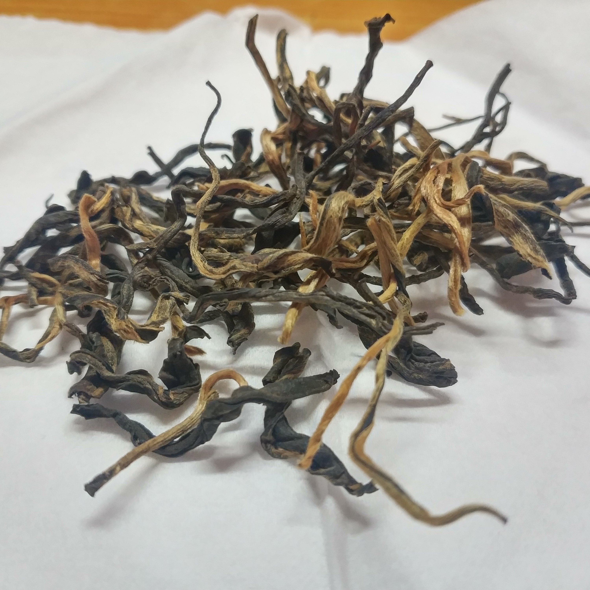
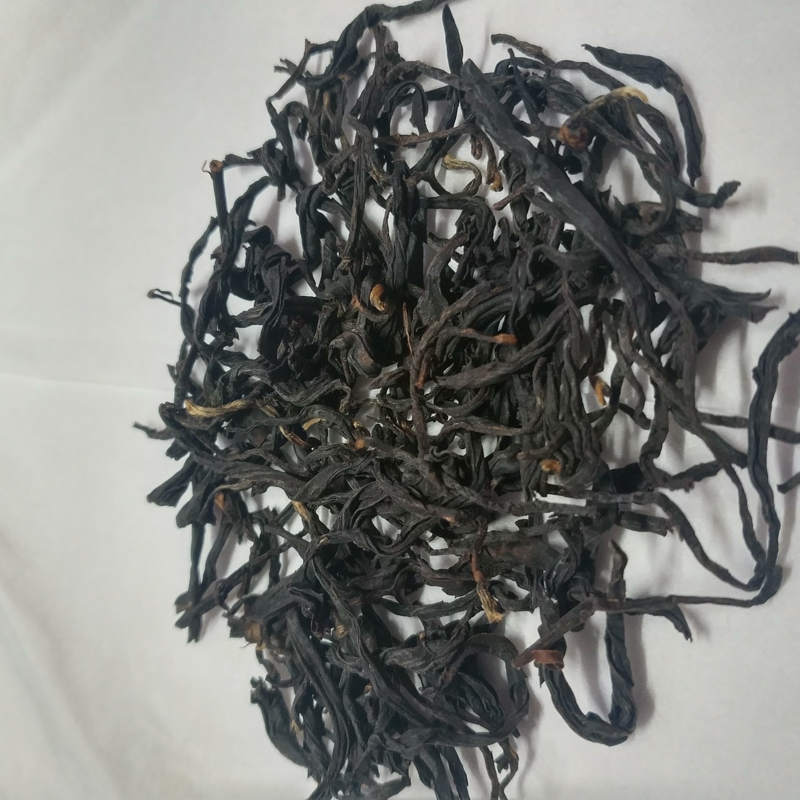

## 红茶随便品鉴计划  

#### 一、综述

本计划为对12种常见红茶进行品鉴，以挑选以后的，各红茶详细信息如下：

|     品名     | 质量/g | 价格 | 每百克价格 | 统计日期 |
| :----------: | :----: | :--: | :--------: | :------: |
| 景迈古树红茶 |  100   |  48  |     48     | 20200930 |
|   金丝蜜芽   |  200   |  88  |     44     | 20200930 |
|   蜜香金针   |  100   | 39.9 |    39.9    | 20200930 |
|   蜜香金螺   |  500   | 160  |     32     | 20200930 |
|   东方美人   |  500   | 160  |     32     | 20200930 |
|   有机松针   |  100   | 29.8 |    29.8    | 20200930 |
|   蜜香金毫   |  100   | 29.8 |    29.8    | 20200930 |
|  糯米香红茶  |  100   | 29.8 |    29.8    | 20200930 |
|   金萱乌龙   |  100   | 28.8 |    28.8    | 20200930 |
|   紫鹃红茶   |  500   | 128  |    25.6    | 20200930 |
|    红毛峰    |  250   | 29.9 |   11.96    | 20200930 |
|    蜜香红    |  500   |  50  |     10     | 20200930 |

本人不太清楚这类茶叶的定价应是多少，只能拿出曾经购买过的茶叶价格以供参考。

|        品名         | 价格/100g |
| :-----------------: | :-------: |
|   天福茗茶 大红袍   |   66.5    |
| 天福茗茶 悠然铁观音 |    74     |

咦，这么一看，这些红茶价格似乎有点低啊。我突然对未来充满了忐忑。

测评工作由家务万能，对泡茶也颇有心得的蕾总进行。

评分标准：

​	对于茶叶而言， 每个人的口感不尽相同，喜好千差万别，无法通过量化的参数进行评价，因此所有分数都将是本人根据自己的口味，进行的主观打分，为此，需要设计一个标准值。故将测评的第一款茶叶蜜香红的分数设定为5分，其余茶叶将在$ [0,10]$分范围内进行取值。

#### 二、冲泡方法

按照店家提供的冲泡方式，统一使用85℃的开水冲泡，0泡洗茶，1~3泡一秒出汤，此后递增。

#### 三、正文

##### 1.蜜香红

​	茶叶闻起来似有咸味，零泡滤茶，倒之。

​	一泡，色泽金黄(我没好意思说尿黄...)， 气味似有枣香。

​	入口，味道稍淡，（极微苦？），有香，回甘明显。

​	二泡，虽说是泡一秒，实际上不可能啊，除非边倒边滤... 茶汤颜色未有明显变化，但甜香味已经较淡了。

​	三泡计划开始增加时间至满水后5秒。由于时间较长，茶汤颜色更浓了。回甘更强，时间很长，但甜味依然不明显。

​	四泡同上，甜味不明显。

​	五泡将加泡至10秒，依然。

​	六泡提高至20秒，依然。

​	七泡，数分钟，顺手我就抽了个莫娜（。＾▽＾）  。色泽深红，未有明显甜味，有点涩，回甘也已降低。

​	结束测评。

   总结：

​	10块钱100g的茶叶，果然也就这样了吧....

​	按照评测规定，本茶叶给予5分。

##### 2.红毛峰

​	鉴于第一款10元级别红茶的糟糕表现，我对本款价格基本一致的红毛峰也有着糟糕的预期。

​	干茶闻起来有一点类似中药的香味，茶叶整体色调更浅，金色部分多于上一位参赛选手。

​	茶汤同样金黄，气味似乎有点甜。

​	同样零泡滤茶，一泡开喝，入口感觉没味儿，仔细在嘴里品品后感觉有微微的甜味，回甘似乎稍弱于蜜香红。

​	二泡，同上，未有明显变化。

​	三泡5秒，甜味稍强，回甘接近消失。

​	四泡10秒，此时长下，汤色偏棕红，微苦，回甘消失。

​	五泡20秒，没啥意思了。

​	总结：甜味高于蜜香红，但回甘较差，总体感觉不佳。 评分：5分。

##### 3.紫鹃红茶

​	从紫鹃红茶开始，茶叶的价格也算是上了一个台阶，来到了25+的挡位上，想来应当是会好一些，让我看看他会 带来怎样的体会吧。

​	 	 												

​	紫鹃树叶本身是紫色的，烘培而成的茶叶颜色也较深。干茶叶似乎有点花香味。

​	茶汤颜色似乎较前两者稍浅，但照片无法体现，故略去不表。

​	茶汤入口无味，回甘淡甜。

​	二泡五秒，逐渐暴躁。因为喝着感觉都没啥味道。（难道是武夷岩茶给我味觉冲坏了？），回甘加强，但依然只有淡淡的甜味。

​	三泡10秒，甜味加强，回甘不太行。

​	四泡数分钟，些许苦涩。

​	总评：这款茶叶并未能给我带来期望中的体会，给个5.2分吧。

​	

